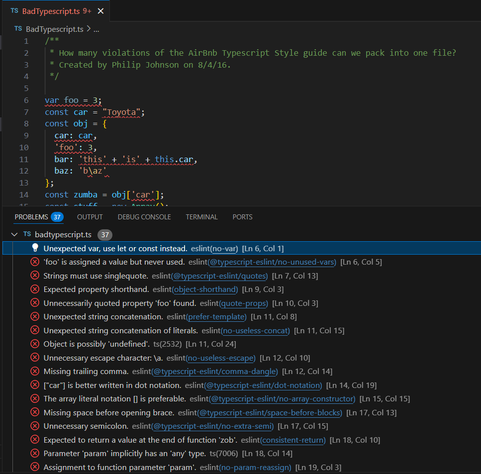
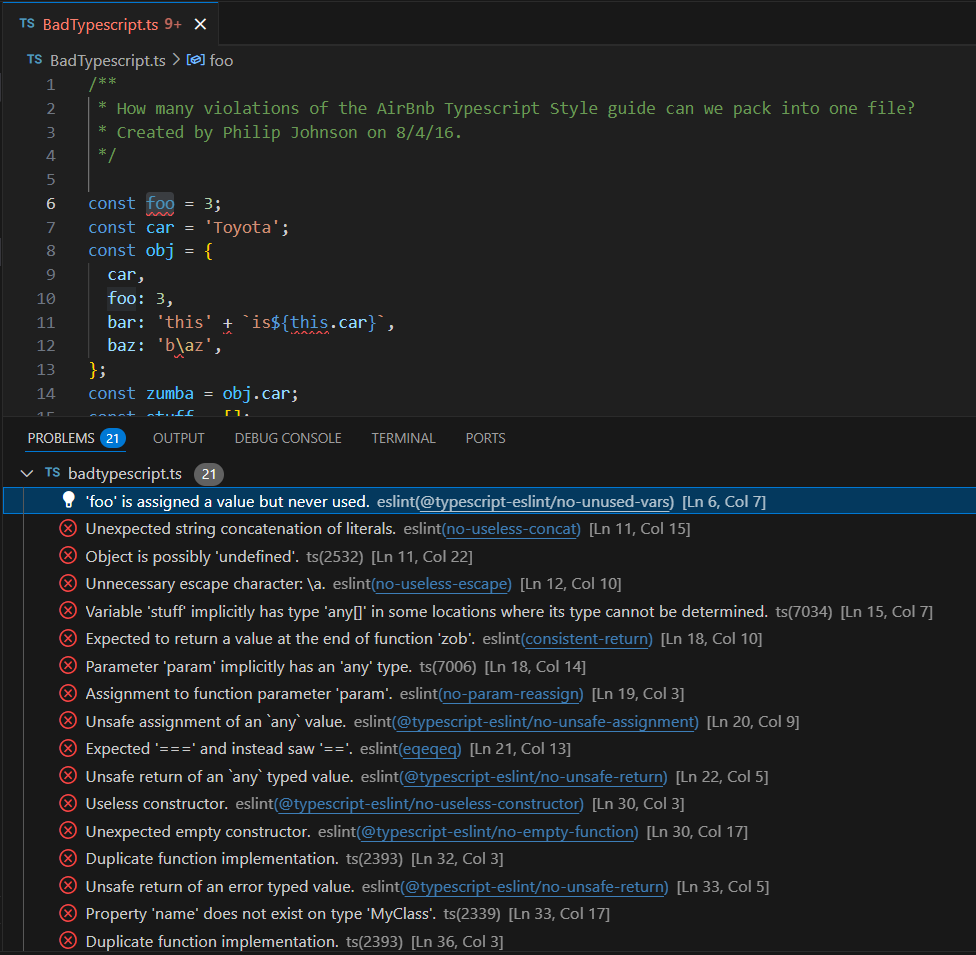

## Letting Go of Errors with ESLint

When I first started to learn how to code, following coding standards was the last thing on my mind. The most important thing to me was having the code work correctly and complete the desired task that I created it for. Over the past few years, as I’ve coded more (and read more code that wasn’t mine), I’ve learned how important it is to follow some sort of standard. Implementing a standard makes it easier to learn to learn code from other sources (assuming that they follow the same standard) as it is organized in a way that you are familiar with, and reading other peoples’ code becomes much easier as you don’t have to try to track where everything is situated within the entire project structure.

## My Enlightenment after using ESLint in VSCode

Using ESLint over the past week has been a learning experience, but an experience that I’ve found to be very helpful. Although it is sometimes quite annoying to see a million errors (I don’t actually create that many errors thankfully) pop up on the screen, it is quite useful to see what is wrong and needs to be corrected. Without ESLint, there would definitely be a few errors that I might miss, such as a wrong declaration of a variable (using var instead of let or const), or not declaring a type, or even forgetting to add a newline at the end of the document (which I always tend to do). Having code that follows standards is very important, as it ensures that you don’t open yourself up to possible errors as a result of poor implementation, and makes it easier if or when you need to make changes to the code down the line.

  
  
My Typescript Before ESLint Fixes

  
  
My Typescript After ESLint Fixes

The great thing about ESLint is that it has a helpful feature that automatically fixes some of the errors, which means that you have less problems to worry about while coding. The left image above is an example of a Typescript document in VScode with a bunch of errors, and the right image is the same Typescript document after running the command “npm run lint-fix” in the terminal which checks for errors and automatically corrects them (though there will still be some errors that you will have to manually fix). This feature has saved me a fair bit of time, allowing me to focus on more major problems in my code.

## Final Thoughts

Considering everything that I said earlier, I would definitely use ESLint if you have not touched ESLint before. Even though the many red lines popping up might be distracting while coding, and you might be intentionally coding in a way that triggers an ESLint error (which can get annoying over time), it is great to have ESLint around, as standardization is very important (especially when working with colleagues), and is great for general readability of code. So, if you ever are unsure about your code and need something to make sure that it is up to par with current coding standards, take a look at ESLint and try it out.

