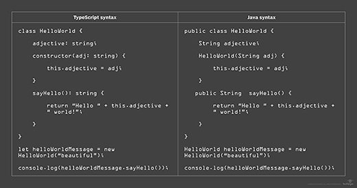

## Getting Technical with TypeScript

When I first learned about types back in high school, I thought that they were annoying and just another thing that you needed to add into your code that wasted time. Oh boy, could I have been any more wrong about that? Although it didn’t take me that long to change my mind (hours and hours of troubleshooting hundreds of lines of PowerShell code because of a wrong type somewhere in the script can change your mind very quickly), the idea of having to declare types was something that felt burdensome for me when I first started out in programming. Nowadays however, this declaring a type feels almost necessary, especially to help with debugging.

## You Don’t Know What You’ve Got Until It’s Gone

Having spent over a year learning statically typed languages like Java, C, and C++ prior to learning JavaScript, I got really used to declaring types for every little variable, subroutine, method, and function in my code. Going back to a dynamically typed language like JavaScript really threw me off (despite having previous experience in other dynamically typed languages like Python and PowerShell), and left me open to making lots of mistakes for data types. This left me yearning for something similar to JavaScript that had strict typing. This is where TypeScript comes in handy, providing the extra features that JavaScript doesn’t currently offer. It took a while to get used to the syntax of TypeScript, especially coming from a background of Java where the types are all declared before the variable or block of code. But, the effort put into learning TypeScript definitely pays off, because TypeScript can save you a lot of time looking for type mistakes in your code, so you don’t have to spend hours debugging code like I did with PowerShell a while back. Debugging is the bane of my existence, so anything that can help with that is a life-saver and a game changer.

(McKenzie, 2018)
<a href="https://www.theserverside.com/tutorial/What-Java-developers-need-to-know-about-TypeScript-syntax">[2]</a>

## Athletic Software Engineering

Philip Johnson’s “Athletic Software Engineering” presents a different, but great way of approaching how to learn within a classroom setting. According to Johnson, “Without competency with a technology stack, it is difficult to experience significant coding and user interface design problems. Significant design problems are needed in order to provide a context for teams to experience process problems. And without the ability to solve both design and process problems, it is difficult to successfully design and implement a “real world” application.” (Johnson, 2017)<a href="https://philipmjohnson.org/essays/ase-2017.html">[1]</a>. Athletic software engineering strives to develop that competency, with training outside of class, and a workout of the day (WOD) in class, which focuses on a student’s ability to complete a given task within a short period of time. 

Having done multiple projects before with a tight deadline in school (for multiple State of Hawaii HACCathons) and work, I find this approach towards learning to be quite beneficial, as I feel that it prepares me and establishes the pace at which I may need to work when I enter the industry after graduation. This approach also forces me to find the most efficient way to code a problem (more lines of code equals more time spent), which helps me to improve and learn new ways to code and solve problems. Not only does it establish a pace and improve efficiency, but it also builds confidence in my ability to write code quickly and efficiently, which is extremely important, as confidence could be the one thing that separates me from reaching that finish line or falling short. As stated by Trine University, “Once the athlete can determine if they have self-confidence they can have a better performance in their sport.” (Trine University, 2023)<a href="https://www.trine.edu/academics/centers/center-for-sports-studies/blog/2023/the_relationship_between_self-confidence_and_performance.aspx">[3]</a>. Like athletes, confidence is key in performing well when it comes to software engineering. By learning with the athletic software engineering approach, you’ll become the equivalent of a top athlete in the field of software engineering, and you’ll have obtained skills that can last a lifetime.

## References

[1] Athletic Software Engineering (2017) | Philip Johnson | Professional Portfolio. (2017). Philip Johnson | Professional Portfolio. https://philipmjohnson.org/essays/ase-2017.html

[2] McKenzie, C. (2018, January 16). What Java developers need to know about TypeScript syntax. TheServerSide.com. https://www.theserverside.com/tutorial/What-Java-developers-need-to-know-about-TypeScript-syntax

[3] The relationship between Self-Confidence and performance. (2023). https://www.trine.edu/academics/centers/center-for-sports-studies/blog/2023/the_relationship_between_self-confidence_and_performance.aspx
