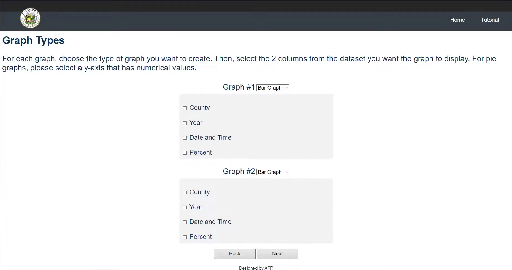
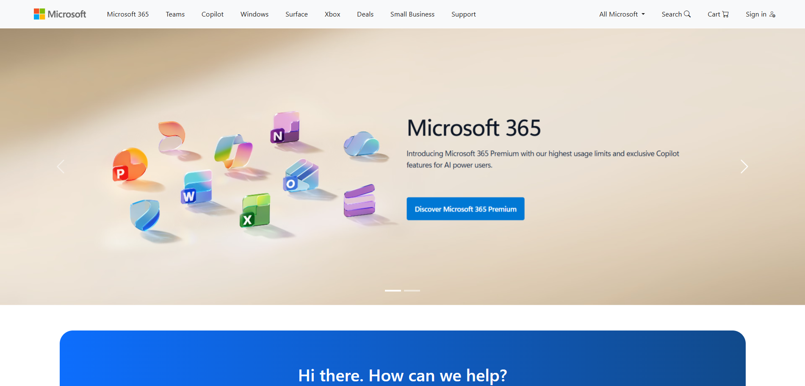

## Early Beginnings of HTML and CSS

It’s been about 5 years since I first started web development. Back in the beginning, things were very simple; I spent most of my time creating basic websites with very little CSS and HTML implementation. Every now and then, I would include an image or two in my work, which would require a little bit of formatting to get right. As I moved into my sophomore and junior years of high school, I started to do more and create more complex websites. This culminated in my participation in the 2021 and 2022 Hawaii Annual Coding Challenges. Specializing in front-end (HTML, CSS, JavaScript) for both challenges, I was required to use everything at my disposal, and learn all kinds of different HTML tags and CSS styles in order to build fully responsive and operational websites.

## First Big Hurdles

Participating in both coding challenges taught me the difficulty and preciseness that one needs to have when styling a page. Each page required tons of testing, checking every little item to see how making small changes to the style would affect the layout of the webpage. Just one error, and the entire page’s layout could be in disarray. I spent countless hours working with my team to fix styling errors and html tagging errors, making sure that everything was as close as it could be to perfect so that the pages looked nice when the final product was ready to be presented.

The image above is a prototype page for the HACC 2022 coding challenge, which utilized no UI framework whatsoever. This page required hundreds of lines of HTML and CSS code to appear how it did, and took hours to complete with a small team of people. Errors were common when working on a short deadline (less than one month), and because of all of the code, it took forever to comb through and figure out what the problem was, let alone how to fix it. Creating something like that is not something that I would want to create again by scratch. This is where UI frameworks come in handy.

## UI Frameworks

UI frameworks are a collection of pre-built components, tools, and guidelines that help streamline the creation of user interfaces. They allow developers to utilize reusable UI elements (buttons, forms, containers, navigation bars, icons, etc.) that each come with built-in styling and interaction standards. This means that developers can build consistent and efficient user interfaces without building up from scratch, saving hours of time depending on the complexity of the website.

## Benefits of Frameworks

Although you have to spend some time learning UI frameworks before you can efficiently utilize them, their code is all documented (especially Bootstrap) and you can just access their code examples on their website if you need anything. In addition, the time spent learning how to use a UI framework is outshined by the time saved by using the framework’s code. All of the code follows a certain standard, which means that you can use the same classes and achieve the same results for two different items within a page, and you can easily understand what is going on just by reading the code (which is not always the case for self-written code). In addition, you can just add a word or two to a class to modify the code to follow a different styling (e.g. py-5 to increase the padding on the top and bottom of an item), which makes styling much more efficient.

The image above is an example of what is possible using a UI framework. In this case, I used Bootstrap 5 to recreate the home page for Microsoft. This image, which encompasses a little less than the top quarter of the entire page that I created, only took about 120 lines of HTML code and 10 lines of CSS code, which is drastically less than what it took to create the less-complicated HACC webpage. This entire webpage has a working navbar with a hidden dropdown in the item “All Microsoft” and a working image carousel, while the HACC webpage only has a simple navbar and a few sets of buttons for user input. This is a great example of how useful UI frameworks can be, as it demonstrates how much more you can get done with less code just by implementing a framework.

## Final Thoughts

I wouldn’t be lying if I told you that using UI frameworks like Bootstrap has made my life much easier. It took a while to get the hang of in the beginning, but after learning the ropes and looking at example code provided online by the UI framework themselves, I’ve now become familiar with how to use them. Using these frameworks has cut down the amount of HTML and CSS that I’ve had to write by crazy amounts, and I’ve been able to complete tasks that would have originally seemed daunting in just an hour or two. There is no complicated process to importing these frameworks either. Bootstrap, for example, just needs you to add a few links to your HTML document, which only increases the total amount of code by a few lines when compared to the hundreds of lines saved. So, if you are ever overwhelmed by the amount of HTML and CSS that you are writing, try a UI framework, and see how it transforms your webpage creation.
