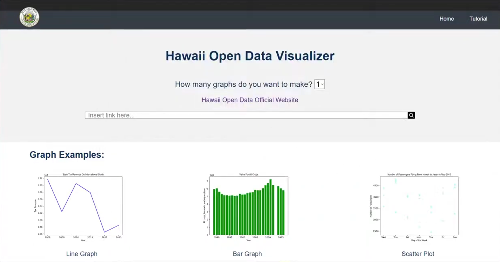

  
  
  
  
  
Examples of some prototype pages within the website

This project was created during the 2022 Hawaii Annual Coding Challenge (HACC) to aid Hawaii Open Data, a website run by the State of Hawaii to provide access for all users to access State data covering various topics, including but not limited to social services, employment, economic development, culture and recreation, and much more. 
We particularly aimed to solve the lack of Hawaii Open Data’s ability to create visualizations for the often overwhelming amounts of data located in their data sets. 
Our solution involved creating a website that could grab a link to the particular data set of your choosing, then created a customizable graph (or graphs if you wanted more than one) with a type of your choosing (bar graph, line graph, pie chart, or scatter plot) utilizing the information grabbed from the data set. 
You could then download the graph (or graphs) as an image for later use.

Due to my experience with the HACC the year prior, I was granted the position of lead for the front end team. 
This meant that in addition to helping create the website design (which was similar to the original Hawaii Open Data site to maintain uniformity) and creating the user experience, I also had to communicate with the leads from our backend and framework teams to figure out what they needed from us and what we wanted them to do to make sure that this project was being developed in the way that the client (Hawaii Open Data) wanted it to be developed. 
Once we completed the design process, my team and I coded the HTML, CSS, and JavaScript required to create the homepage, user input pages (the page which requested the data set link, and the page which allowed for customization of the graph or graphs), navigation, and graph output page, all of which included support for smaller devices. 
This project in particular taught me how to manage a team, communicate effectively with other teams and within my own team, and how to prioritize tasks to aid in the progression of the overall website. 
I also gained experience in learning on the fly, as this was my first year using JavaScript, with the added pressure of learning and having to become confident in JavaScript in less than a month due to the constraints of the competition.

Link to the Devpost: <a href="https://devpost.com/software/2022-hacc-submission">https://devpost.com/software/2022-hacc-submission</a>
